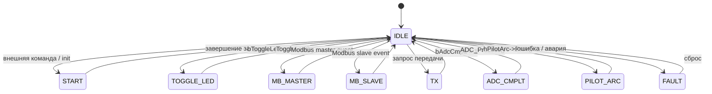

# ⚡ ** Контроллер 6 DC‑DC силовых чопперов на Modbus RTU**

## 📘 **Описание проекта**
Проект представляет собой систему управления шестью силовыми преобразователями понижающего напряжения (чопперами).  
Основная плата на **STM32F407** выполняет:

- управление 6-ю силовыми модулями  
- обмен по **Modbus RTU** через два независимых интерфейса RS‑485  
- измерение токов и напряжения по трём каналам АЦП с **DMA**  
- цифровую фильтрацию и статистическую обработку измерений  
- выполнение команд релейного управления  
- централизованную **машину состояний**, управляющую всей логикой источника питания  

Проект написан под **IAR EWARM 8.32.3**, использует **CMSIS v5.0.8 (2017–2018)**, HAL.

---

# 🖥️ Рабочие процессы (State Machine)


---

# 🔧 **Аппаратная часть**

### **Микроконтроллер**
- STM32F407 (Cortex‑M4, 168 MHz)
- Питание 3.3 В
- Тактирование от внешнего кварца 8/25 MHz

### **Интерфейсы**
- **UART1 → RS‑485** — внешний мастер (ПК/ПЛК)
- **UART2 → RS‑485** — внутренняя сеть из 6 подчинённых плат
- **ADC1 (3 канала) + DMA2 Stream0**  
  - Ток 1  
  - Ток 2  
  - Напряжение  

### **Силовая часть**
- 6 независимых DC‑DC чопперов  
- Управление ключами через таймеры (TIMx)  
- Защита по току/напряжению  

---

# 📡 **Протоколы связи**

## **Modbus RTU**
Используется на двух интерфейсах:

| Интерфейс | UART | Роль | Скорость |
|----------|------|------|----------|
| RS‑485 #1 | UART1 | Slave | 9600–115200 |
| RS‑485 #2 | UART2 | Master | 9600–115200 |

### **Поддерживаемые функции**
- `0x03` — Read Holding Registers  
- `0x06` — Write Single Register  
- `0x10` — Write Multiple Registers  

---

# 🧠 **Обработка измерений**

## **1. Снятие данных**
- АЦП работает в режиме **scan + continuous**  
- DMA заполняет кольцевой буфер  
- Частота выборки задаётся таймером  

## **2. Пост‑обработка**
Алгоритм:

1. Сортировка выборки  
2. Отбрасывание хвостов (например, 10% снизу и сверху)  
3. Усреднение оставшихся значений  
4. НЧ‑фильтрация (экспоненциальная или FIR)  

Это позволяет получить **устойчивые измерения** даже при шуме силовой части.

---

# 🛠 **Сборка и прошивка**

## **Среда разработки**
- IAR EWARM **8.32.3**
- CMSIS **v5.0.8**
- ARM GCC (опционально для CI)

## **Сборка**
Проект собирается через IAR Workspace:

```
EWARM/Project.eww
```

## **Прошивка**
Через ST‑Link Utility или segger jlink

---

# 🧪 **Тестирование**
- UART‑логирование (скорость 115200)  
- Проверка Modbus через Modbus Poll / QModMaster  
- Тестирование DMA‑измерений осциллографом  
- Проверка переходов машины состояний  

---

# 📝 **TODO** 
- [ ] Уточнить документацию
- [ ] Добавить unit‑тесты на алгоритмы обработки  
- [ ] Добавить диаграмму состояний в Docs  
- [ ] ++ Wi-Fi
